Next steps scaling using ALB, service and splitting monolith to microservices.
===============================================================================
* **Lab 2:** [Deploy the container using AWS Fargate](#lab-2---deploy-your-container-using-ecrecs)
* **Lab 3:** [Scale the adoption platform monolith with an ALB and an ECS Service](#lab-3---scale-the-adoption-platform-monolith-with-an-alb)
* **Lab 4:** [Incrementally build and deploy more microservices with AWS Fargate](#lab-4-incrementally-build-and-deploy-each-microservice-using-fargate)
* **Cleanup** [Put everything away nicely](#workshop-cleanup)

## Lab 2 - Deploy your container using ECR/ECS

Deploying individual containers is not difficult.  However, when you need to coordinate many container deployments, a container management tool like ECS can greatly simplify the task (no pun intended).

ECS refers to a JSON formatted template called a [Task Definition](http://docs.aws.amazon.com/AmazonECS/latest/developerguide/task_definitions.html) that describes one or more containers making up your application or service.  The task definition is the recipe that ECS uses to run your containers as a **task** on your EC2 instances or AWS Fargate.

<details>
<summary>INFO: What is a task?</summary>
A task is a running set of containers on a single host. You may hear or see 'task' and 'container' used interchangeably. Often, we refer to tasks instead of containers because a task is the unit of work that ECS launches and manages on your cluster. A task can be a single container, or multiple containers that run together.

Fun fact: a task is very similar to a Kubernetes 'pod'.
</details>

Most task definition parameters map to options and arguments passed to the [docker run](https://docs.docker.com/engine/reference/run/) command which means you can describe configurations like which container image(s) you want to use, host:container port mappings, cpu and memory allocations, logging, and more.

In this lab, you will create a task definition to serve as a foundation for deploying the containerized adoption platform stored in ECR with ECS. You will be using the [Fargate](https://aws.amazon.com/fargate/) launch type, which let's you run containers without having to manage servers or other infrastructure. Fargate containers launch with a networking mode called [awsvpc](https://docs.aws.amazon.com/AmazonECS/latest/developerguide/task-networking.html), which gives ECS tasks the same networking properties of EC2 instances.  Tasks will essentially receive their own [elastic network interface](https://docs.aws.amazon.com/AWSEC2/latest/UserGuide/using-eni.html).  This offers benefits like task-specific security groups.  Let's get started!

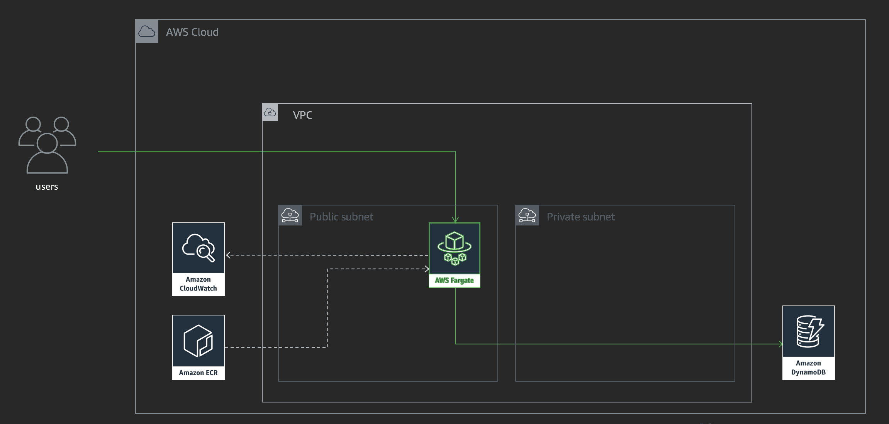

*Note: You will use the AWS Management Console for this lab, but remember that you can programmatically accomplish the same thing using the AWS CLI, SDKs, or CloudFormation.*

### Instructions:

1. Create an ECS task definition that describes what is needed to run the monolith.

    The CloudFormation template you ran at the beginning of the workshop created some placeholder ECS resources running a simple "Hello World" NGINX container. (You can see this running now at the public endpoint for the ALB also created by CloudFormation available in `cfn-output.json`.) We'll begin to adapt this placeholder infrastructure to run the monolith by creating a new "Task Definition" referencing the container built in the previous lab.

    In the AWS Management Console, navigate to [Task Definitions](https://console.aws.amazon.com/ecs/home#/taskDefinitions) in the ECS dashboard. Find the Task Definition named <code>Monolith-Definition-<b><i>STACK_NAME</i></b></code>, select it, and click "Create new revision". Select the "monolith-service" container under "Container Definitions", and update "Image" to point to the Image URI of the monolith container that you just pushed to ECR (something like `018782361163.dkr.ecr.us-east-1.amazonaws.com/mysfit-mono-oa55rnsdnaud:latest`).

    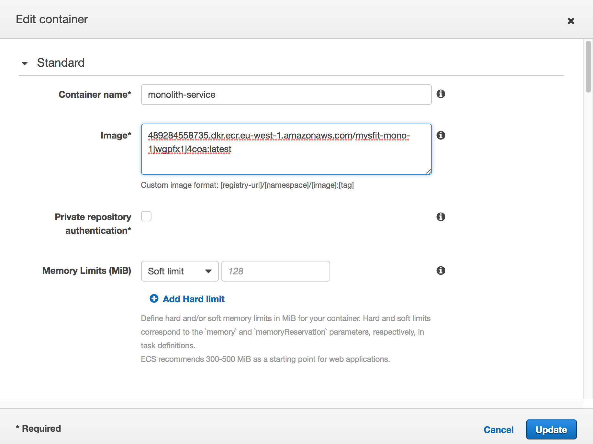

2. Check the CloudWatch logging settings in the container definition.

    In the previous lab, you attached to the running container to get *stdout*, but no one should be doing that in production and it's good operational practice to implement a centralized logging solution.  ECS offers integration with [CloudWatch logs](https://docs.aws.amazon.com/AmazonCloudWatch/latest/logs/WhatIsCloudWatchLogs.html) through an awslogs driver that can be enabled in the container definition.

    Verify that under "Storage and Logging", the "log driver" is set to "awslogs".

    The Log configuration should look something like this:

    

    Click "Update" to save the container settings and then "Create" to create the Task Definition revision.

3. Run the task definition using the [Run Task](https://docs.aws.amazon.com/AmazonECS/latest/developerguide/ecs_run_task.html) method.

    You should be at the task definition view where you can do things like create a new revision or invoke certain actions.  In the **Actions** dropdown, select **Run Task** to launch your container.

    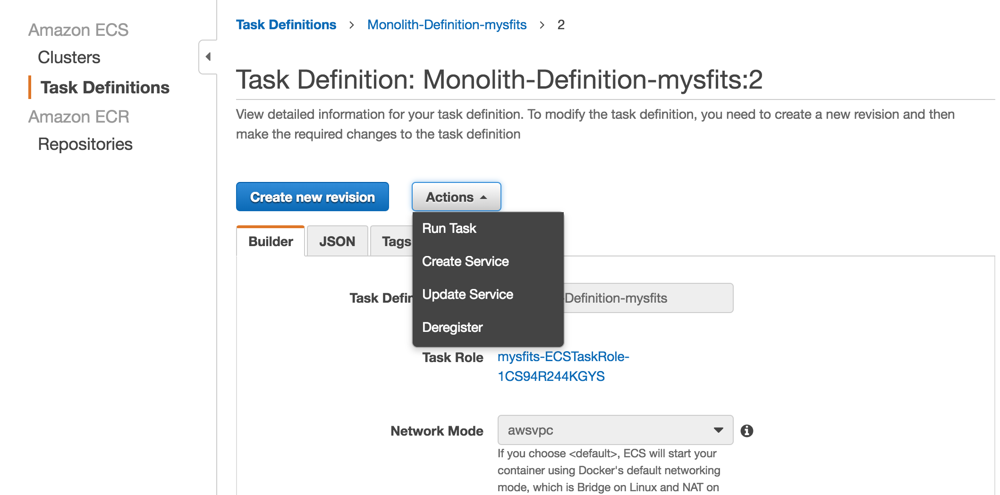

    Configure the following fields:

    * **Launch Type** - select **Fargate**
    * **Cluster** - select your workshop cluster from the dropdown menu
    * **Task Definition** - select the task definition you created from the dropdown menu

    In the "VPC and security groups" section, enter the following:

    * **Cluster VPC** - Your workshop VPC, named like <code>Mysfits-VPC-<b><i>STACK_NAME</i></b></code>
    * **Subnets** - Select a public subnet, such as <code>Mysfits-PublicOne-<b><i>STACK_NAME</i></b></code>
    * **Security goups** - The default is fine, but you can confirm that it allows inbound traffic on port 80
    * **Auto-assign public IP** - "ENABLED"

    Leave all remaining fields as their defaults and click **Run Task**.

    You'll see the task start in the **PENDING** state (the placeholder NGINX task is still running as well).

    

    In a few seconds, click on the refresh button until the task changes to a **RUNNING** state.

    

4. Test the running task by using cURL from your Cloud9 environment to send a simple GET request.

    First we need to determine the IP of your task. When using the "Fargate" launch type, each task gets its own ENI and Public/Private IP address. Click on the ID of the task you just launched to go to the detail page for the task. Note down the Public IP address to use with your curl command.


    

    Run the same curl command as before (or view the endpoint in your browser) and ensure that you get a list of Mysfits in the response.

    <details>
    <summary>HINT: curl refresher</summary>
    <pre>
    $ curl http://<b><i>TASK_PUBLIC_IP_ADDRESS</i></b>/mysfits
    </pre>
    </details>

    Navigate to the [CloudWatch Logs dashboard](https://console.aws.amazon.com/cloudwatch/home#logs:), and click on the monolith log group (e.g.: `mysfits-MythicalMonolithLogGroup-LVZJ0H2I2N4`).  Logging statements are written to log streams within the log group.  Click on the most recent log stream to view the logs.  The output should look very familiar from your testing in Lab 1.

    

    If the curl command was successful, stop the task by going to your cluster, select the **Tasks** tab, select the running monolith task, and click **Stop**.

### Checkpoint:
Nice work!  You've created a task definition and are able to deploy the monolith container using ECS.  You've also enabled logging to CloudWatch Logs, so you can verify your container works as expected.

[*^ back to the top*](#monolith-to-microservices-with-docker-and-aws-fargate)

## Lab 3 - Scale the adoption platform monolith with an ALB

The Run Task method you used in the last lab is good for testing, but we need to run the adoption platform as a long running process.

In this lab, you will use an Elastic Load Balancing [Appliction Load Balancer (ALB)](https://aws.amazon.com/elasticloadbalancing/) to distribute incoming requests to your running containers. In addition to simple load balancing, this provieds capabilities like path-based routing to different services.

What ties this all together is an **ECS Service**, which maintains a desired task count (i.e. n number of containers as long running processes) and integrates with the ALB (i.e. handles registration/deregistration of containers to the ALB). An initial ECS service and ALB were created for you by CloudFormation at the beginning of the workshop. In this lab, you'll update those resources to host the containerized monolith service. Later, you'll make a new service from scratch once we break apart the monolith.

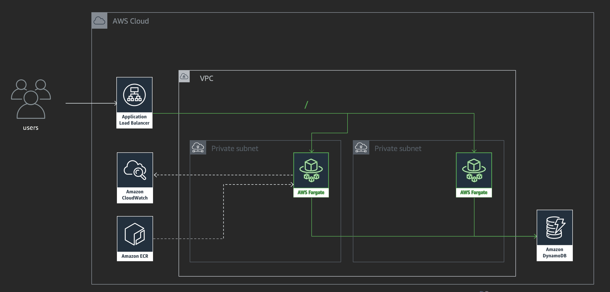


### Instructions:

1. Test the placeholder service:

    The CloudFormation stack you launched at the beginning of the workshop included an ALB in front of a placeholder ECS service running a simple container with the NGINX web server. Find the hostname for this ALB in the "LoadBalancerDNS" output variable in the `cfn-output.json` file, and verify that you can load the NGINX default page:

    


3. Update the service to use your task definition:

    Find the ECS cluster named <code>Cluster-<i><b>STACK_NAME</b></i></code>, then select the service named <code><b><i>STACK_NAME</i></b>-MythicalMonolithService-XXX</code> and click "Update" in the upper right:

    

    Update the Task Definition to the revision you created in the previous lab, then click through the rest of the screens and update the service.

4. Test the functionality of the website:

    You can monitor the progress of the deployment on the "Tasks" tab of the service page:

    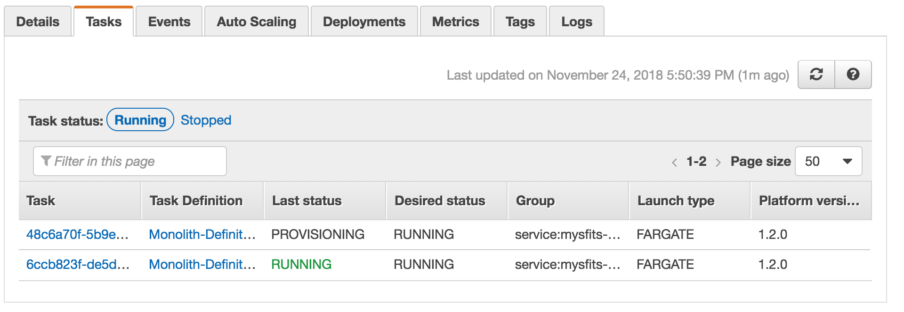

    The update is fully deployed once there is just one instance of the Task running the latest revision:

    

    Visit the S3 static site for the Mythical Mysfits (which was empty earlier) and you should now see the page filled with Mysfits once your update is fully deployed. Remember you can access the website at <code>http://<b><i>BUCKET_NAME</i></b>.s3-website.<b><i>REGION</i></b>.amazonaws.com/</code> where the bucket name can be found in the `workshop-1/cfn-output.json` file:

    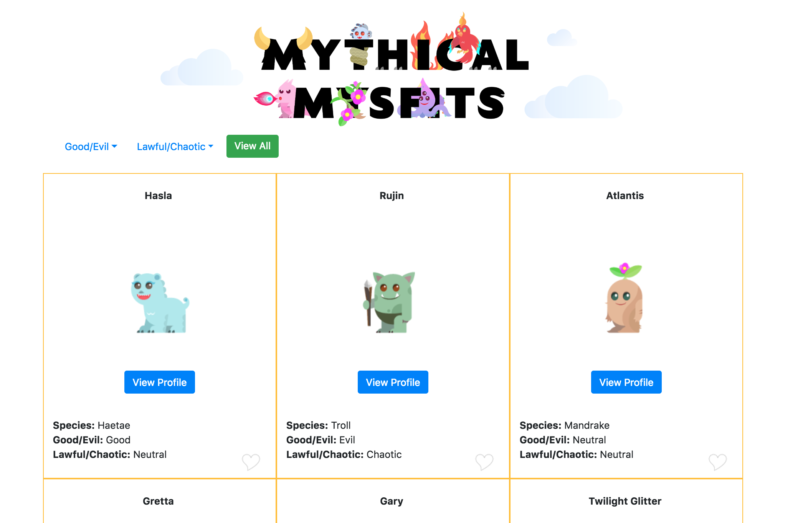

    Click the heart icon to like a Mysfit, then click the Mysfit to see a detailed profile, and ensure that the like count has incremented:

    

    This ensures that the monolith can read from and write to DynamoDB, and that it can process likes. Check the CloudWatch logs from ECS and ensure that you can see the "Like processed." message in the logs:

    

<details>
<summary>INFO: What is a service and how does it differ from a task??</summary>

An [ECS service](https://docs.aws.amazon.com/AmazonECS/latest/developerguide/ecs_services.html) is a concept where ECS allows you to run and maintain a specified number (the "desired count") of instances of a task definition simultaneously in an ECS cluster.


tl;dr a **Service** is comprised of multiple **tasks** and will keep them up and running. See the link above for more detail.

</details>

### Checkpoint:
Sweet! Now you have a load-balanced ECS service managing your containerized Mythical Mysfits application. It's still a single monolith container, but we'll work on breaking it down next.

[*^ back to the top*](#monolith-to-microservices-with-docker-and-aws-fargate)

## Lab 4: Incrementally build and deploy each microservice using Fargate

It's time to break apart the monolithic adoption into microservices. To help with this, let's see how the monolith works in more detail.

> The monolith serves up several different API resources on different routes to fetch info about Mysfits, "like" them, or adopt them.
>
> The logic for these resources generally consists of some "processing" (like ensuring that the user is allowed to take a particular action, that a Mysfit is eligible for adoption, etc) and some interaction with the persistence layer, which in this case is DynamoDB.

> It is often a bad idea to have many different services talking directly to a single database (adding indexes and doing data migrations is hard enough with just one application), so rather than split off all of the logic of a given resource into a separate service, we'll start by moving only the "processing" business logic into a separate service and continue to use the monolith as a facade in front of the database. This is sometimes described as the [Strangler Application pattern](https://www.martinfowler.com/bliki/StranglerApplication.html), as we're "strangling" the monolith out of the picture and only continuing to use it for the parts that are toughest to move out until it can be fully replaced.

> The ALB has another feature called [path-based routing](https://docs.aws.amazon.com/elasticloadbalancing/latest/application/load-balancer-listeners.html#path-conditions), which routes traffic based on URL path to particular target groups.  This means you will only need a single instance of the ALB to host your microservices.  The monolith service will receive all traffic to the default path, '/'.  Adoption and like services will be '/adopt' and '/like', respectively.

Here's what you will be implementing:


*Note: The green tasks denote the monolith and the orange tasks denote the "like" microservice

    
As with the monolith, you'll be using [Fargate](https://aws.amazon.com/fargate/) to deploy these microservices, but this time we'll walk through all the deployment steps for a fresh service.

### Instructions:

1. First, we need to add some glue code in the monolith to support moving the "like" function into a separate service. You'll use your Cloud9 environment to do this.  If you've closed the tab, go to the [Cloud9 Dashboard](https://console.aws.amazon.com/cloud9/home) and find your environment. Click "**Open IDE**". Find the `app/monolith-service/service/mythicalMysfitsService.py` source file, and uncomment the following section:

    ```
    # @app.route("/mysfits/<mysfit_id>/fulfill-like", methods=['POST'])
    # def fulfillLikeMysfit(mysfit_id):
    #     serviceResponse = mysfitsTableClient.likeMysfit(mysfit_id)
    #     flaskResponse = Response(serviceResponse)
    #     flaskResponse.headers["Content-Type"] = "application/json"
    #     return flaskResponse
    ```

    This provides an endpoint that can still manage persistence to DynamoDB, but omits the "business logic" (okay, in this case it's just a print statement, but in real life it could involve permissions checks or other nontrivial processing) handled by the `process_like_request` function.

2. With this new functionality added to the monolith, rebuild the monolith docker image with a new tag, such as `nolike`, and push it to ECR just as before (It is a best practice to avoid the `latest` tag, which can be ambiguous. Instead choose a unique, descriptive name, or even better user a Git SHA and/or build ID):

    <pre>
    $ cd app/monolith-service
    $ docker build -t monolith-service:nolike .
    $ docker tag monolith-service:nolike <b><i>ECR_REPOSITORY_URI</i></b>:nolike
    $ docker push <b><i>ECR_REPOSITORY_URI</i></b>:nolike
    </pre>

3. Now, just as in Lab 2, create a new revision of the monolith Task Definition (this time pointing to the "nolike" version of the container image), AND update the monolith service to use this revision as you did in Lab 3.

4. Now, build the like service and push it to ECR.

    To find the like-service ECR repo URI, navigate to [Repositories](https://console.aws.amazon.com/ecs/home#/repositories) in the ECS dashboard, and find the repo named like <code><b><i>STACK_NAME</i></b>-like-XXX</code>.  Click on the like-service repository and copy the repository URI.

    

    *Note: Your URI will be unique.*

    <pre>
    $ cd app/like-service
    $ docker build -t like-service .
    $ docker tag like-service:latest <b><i>ECR_REPOSITORY_URI</i></b>:latest
    $ docker push <b><i>ECR_REPOSITORY_URI</i></b>:latest
    </pre>

5. Create a new **Task Definition** for the like service using the image pushed to ECR.

    Navigate to [Task Definitions](https://console.aws.amazon.com/ecs/home#/taskDefinitions) in the ECS dashboard. Click on **Create New Task Definition**.

    Select **Fargate** launch type, and click **Next step**.

    Enter a name for your Task Definition, e.g. mysfits-like.

    In the "[Task execution IAM role](https://docs.aws.amazon.com/AmazonECS/latest/developerguide/task_execution_IAM_role.html)" section, Fargate needs an IAM role to be able to pull container images and log to CloudWatch.  Select the role named like <code><b><i>STACK_NAME</i></b>-EcsServiceRole-XXXXX</code> that was already created for the monolith service.

    The "[Task size](https://docs.aws.amazon.com/AmazonECS/latest/developerguide/task_definition_parameters.html#task_size)" section lets you specify the total cpu and memory used for the task. This is different from the container-specific cpu and memory values, which you will also configure when adding the container definition.

    Select **0.5GB** for **Task memory (GB)** and select **0.25vCPU** for **Task CPU (vCPU)**.

    Your progress should look similar to this:

    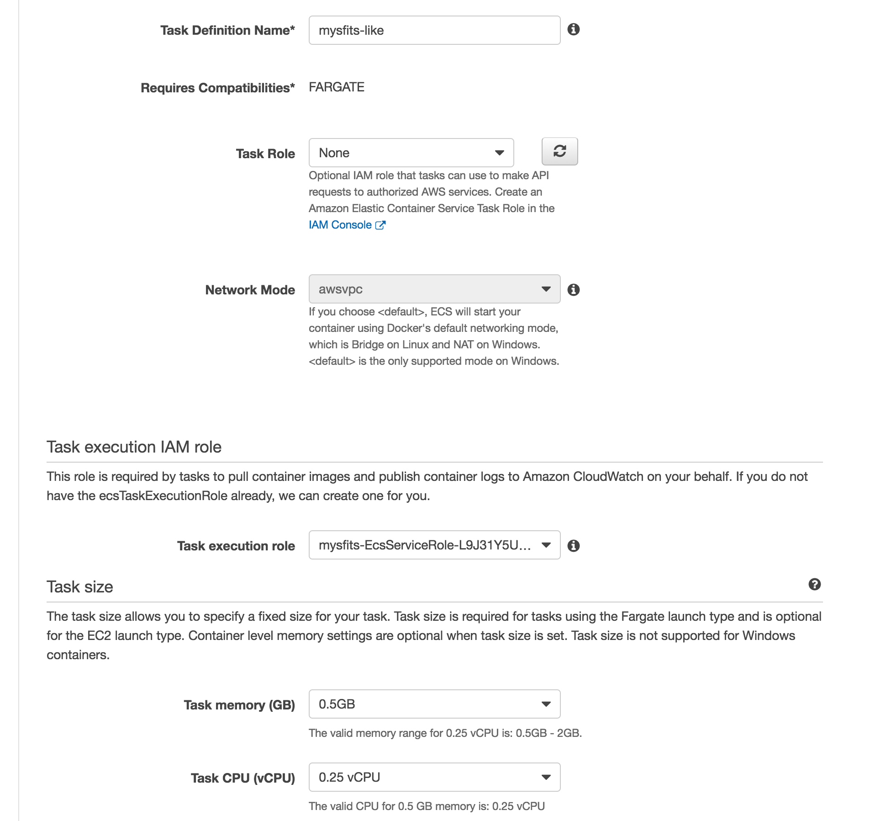

    Click **Add container** to associate the like service container with the task.

    Enter values for the following fields:

    * **Container name** - this is a logical identifier, not the name of the container image (e.g. `mysfits-like`).
    * **Image** - this is a reference to the container image stored in ECR.  The format should be the same value you used to push the like service container to ECR - <pre><b><i>ECR_REPOSITORY_URI</i></b>:latest</pre>
    * **Port mapping** - set the container port to be `80`.

    Here's an example:

    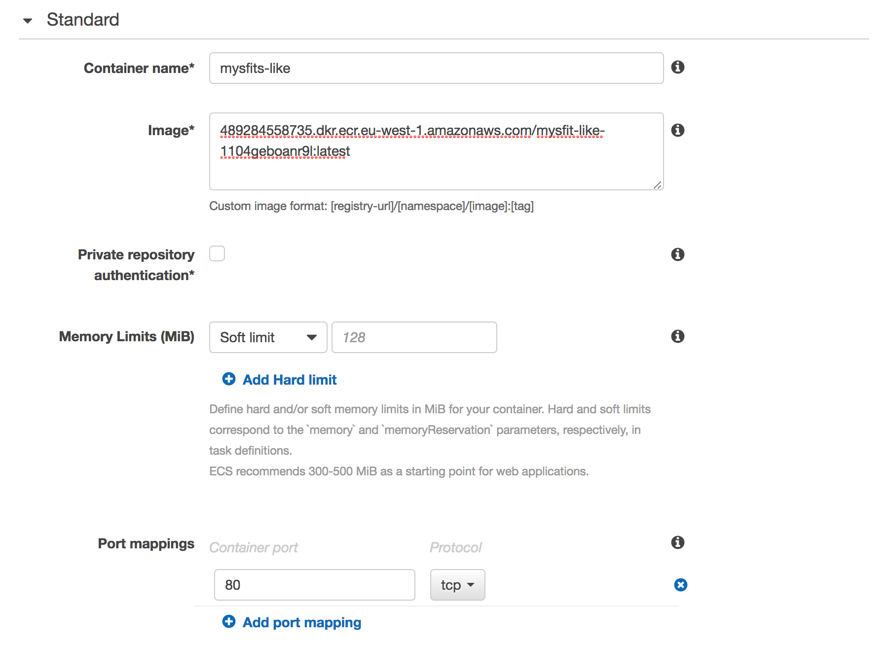

    *Note: Notice you didn't have to specify the host port because Fargate uses the awsvpc network mode. Depending on the launch type (EC2 or Fargate), some task definition parameters are required and some are optional. You can learn more from our [task definition documentation](https://docs.aws.amazon.com/AmazonECS/latest/developerguide/task_definitions.html).*

    The like service code is designed to call an endpoint on the monolith to persist data to DynamoDB. It references an environment variable called `MONOLITH_URL` to know where to send fulfillment.

    Scroll down to the "Advanced container configuration" section, and in the "Environment" section, create an environment variable using `MONOLITH_URL` for the key. For the value, enter the **ALB DNS name** that currently fronts the monolith.

    Here's an example (make sure you enter just the hostname like `alb-mysfits-1892029901.eu-west-1.elb.amazonaws.com` without any "http" or slashes):

    

    Fargate conveniently enables logging to CloudWatch for you.  Keep the default log settings and take note of the **awslogs-group** and the **awslogs-stream-prefix**, so you can find the logs for this task later.

    Here's an example:

    

    Click **Add** to associate the container definition, and click **Create** to create the task definition.

6. Create an ECS service to run the Like Service task definition you just created and associate it with the existing ALB.

    Navigate to the new revision of the Like task definition you just created.  Under the **Actions** drop down, choose **Create Service**.

    Configure the following fields:

    * **Launch type** - select **Fargate**
    * **Cluster** - select your workshop ECS cluster
    * **Service name** - enter a name for the service (e.g. `mysfits-like-service`)
    * **Number of tasks** - enter `1`.

    Here's an example:

    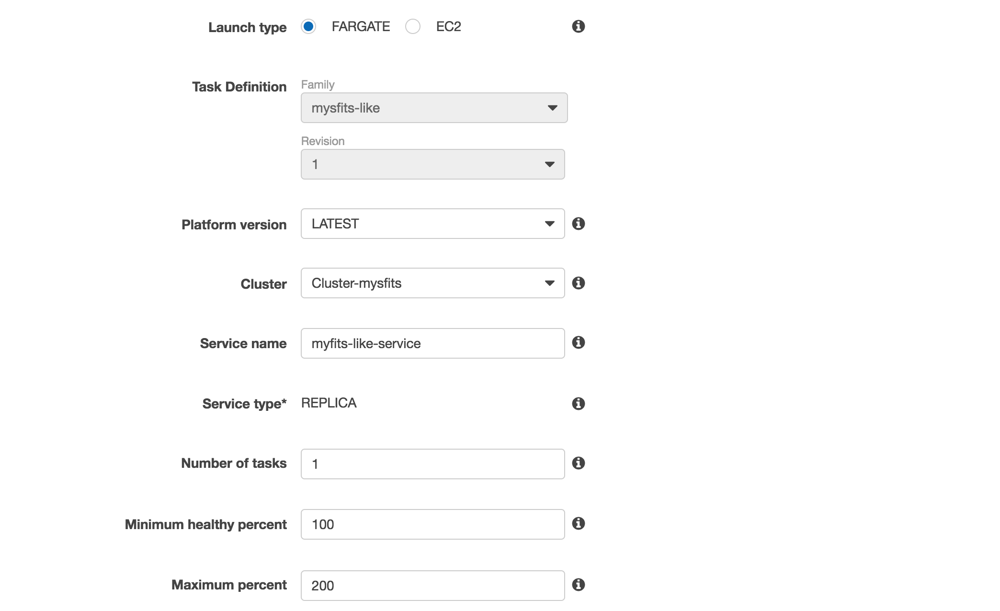

    Leave other settings as defaults and click **Next Step**

    Since the task definition uses awsvpc network mode, you can choose which VPC and subnet(s) to host your tasks.

    For **Cluster VPC**, select your workshop VPC.  And for **Subnets**, select the private subnets; you can identify these based on the tags.

    Leave the default security group which allows inbound port 80.  If you had your own security groups defined in the VPC, you could assign them here.

    Here's an example:

    

    Scroll down to "Load balancing" and select **Application Load Balancer** for *Load balancer type*.

    You'll see a **Load balancer name** drop-down menu appear.  Select the same Mythical Mysfits ALB used for the monolith ECS service.

    In the "Container to load balance" section, select the **Container name : port** combo from the drop-down menu that corresponds to the like service task definition.

    Your progress should look similar to this:

    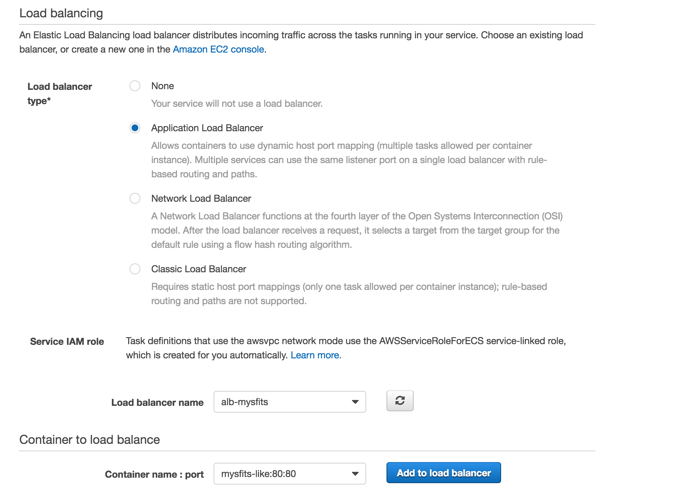

    Click **Add to load balancer** to reveal more settings.

    For the **Production listener Port**, select **80:HTTP** from the drop-down.

    For the **Target Group Name**, you'll need to create a new group for the Like containers, so leave it as "create new" and replace the auto-generated value with `mysfits-like`.  This is a friendly name to identify the target group, so any value that relates to the Like microservice will do.

    Change the path pattern to `/mysfits/*/like`.  The ALB uses this path to route traffic to the like service target group.  This is how multiple services are being served from the same ALB listener.  Note the existing default path routes to the monolith target group.

    For **Evaluation order** enter `1`.  Edit the **Health check path** to be `/`.

    And finally, uncheck **Enable service discovery integration**.  While public namespaces are supported, a public zone needs to be configured in Route53 first.  Consider this convenient feature for your own services, and you can read more about [service discovery](https://docs.aws.amazon.com/AmazonECS/latest/developerguide/service-discovery.html) in our documentation.

    Your configuration should look similar to this:

    

    Leave the other fields as defaults and click **Next Step**.

    Skip the Auto Scaling configuration by clicking **Next Step**.

    Click **Create Service** on the Review page.

    Once the Service is created, click **View Service** and you'll see your task definition has been deployed as a service.  It starts out in the **PROVISIONING** state, progresses to the **PENDING** state, and if your configuration is successful, the service will finally enter the **RUNNING** state.  You can see these state changes by periodically click on the refresh button.

7. Once the new like service is deployed, test liking a Mysfit again by visiting the website. Check the CloudWatch logs again and make sure that the like service now shows a "Like processed." message. If you see this, you have succesfully factored out like functionality into the new microservice!

8. If you have time, you can now remove the old like endpoint from the monolith now that it is no longer seeing production use.

    Go back to your Cloud9 environment where you built the monolith and like service container images.

    In the monolith folder, open mythicalMysfitsService.py in the Cloud9 editor and find the code that reads:

    ```
    # increment the number of likes for the provided mysfit.
    @app.route("/mysfits/<mysfit_id>/like", methods=['POST'])
    def likeMysfit(mysfit_id):
        serviceResponse = mysfitsTableClient.likeMysfit(mysfit_id)
        process_like_request()
        flaskResponse = Response(serviceResponse)
        flaskResponse.headers["Content-Type"] = "application/json"
        return flaskResponse
    ```
    Once you find that line, you can delete it or comment it out.

    *Tip: if you're not familiar with Python, you can comment out a line by adding a hash character, "#", at the beginning of the line.*

9. Build, tag and push the monolith image to the monolith ECR repository.

    Use the tag `nolike2` now instead of `nolike`.

    <pre>
    $ docker build -t monolith-service:nolike2 .
    $ docker tag monolith-service:nolike <b><i>ECR_REPOSITORY_URI</i></b>:nolike2
    $ docker push <b><i>ECR_REPOSITORY_URI</i></b>:nolike2
    </pre>

    If you look at the monolith repository in ECR, you'll see the pushed image tagged as `nolike2`:

    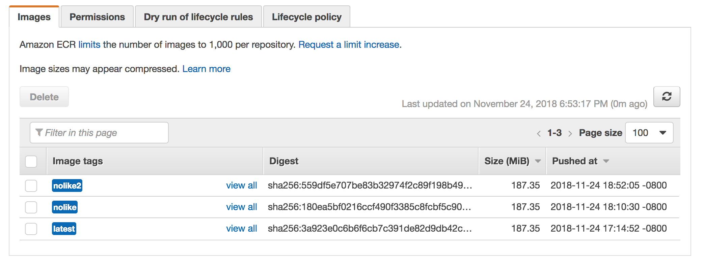

10. Now make one last Task Definition for the monolith to refer to this new container image URI (this process should be familiar now, and you can probably see that it makes sense to leave this drudgery to a CI/CD service in production), update the monolith service to use the new Task Definition, and make sure the app still functions as before.

### Checkpoint:
Congratulations, you've successfully rolled out the like microservice from the monolith.  If you have time, try repeating this lab to break out the adoption microservice.  Otherwise, please remember to follow the steps below in the **Workshop Cleanup** to make sure all assets created during the workshop are removed so you do not see unexpected charges after today.

## Workshop Cleanup

This is really important because if you leave stuff running in your account, it will continue to generate charges.  Certain things were created by CloudFormation and certain things were created manually throughout the workshop.  Follow the steps below to make sure you clean up properly.

Delete manually created resources throughout the labs:

* ECS service(s) - first update the desired task count to be 0.  Then delete the ECS service itself.
* ECR - delete any Docker images pushed to your ECR repository.
* CloudWatch logs groups
* ALBs and associated target groups

Finally, [delete the CloudFormation stack](http://docs.aws.amazon.com/AWSCloudFormation/latest/UserGuide/cfn-console-delete-stack.html) launched at the beginning of the workshop to clean up the rest.  If the stack deletion process encountered errors, look at the Events tab in the CloudFormation dashboard, and you'll see what steps failed.  It might just be a case where you need to clean up a manually created asset that is tied to a resource goverened by CloudFormation.
